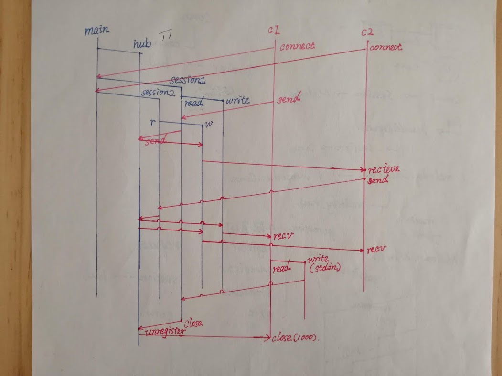

## 适用于原型开发的轻量级WebSocket框架——melody

melody是一款轻量级的WebSocket框架，项目地址：https://github.com/olahol/melody 。

### 功能

该框架目前实现了一下功能：
- 接口简单易用，类似 `net/http` 或者 Gin
- 可以面向所有会话广播，也可以面向特定的会话广播
- 消息缓冲让并发写入变得安全
- 可自动处理 `ping/pong` 和会话超时
- 可以存储会说中的数据

### 案例

运用该框架可以快速实现的原型有：

#### 一、聊天应用

可以进行点对点聊天，以及群聊

#### 二、其他应用

1. 文件监视：当文件发生更改时立即同步
2. 同步控制：每个新的会话都会生成一个Gopher，可以跟随鼠标指针移动；会话结束时，该Gopher消失，但是，不会影响其他会话的Gopher。
   1. 这个案例经过扩展可以制成一个简单的游戏：https://qiita.com/tashxii/items/75b99c32b024a1c06eb7
   2. 也可以扩展成一个类似于Office 365那样，可以同步修改文件的应用（TODO）

### 问题

该项目现在处于无人维护的状态，目前已经发现的问题如下：

* 示例程序中的外部依赖已经过期
  * https://github.com/olahol/melody/pull/40
  * https://github.com/olahol/melody/pull/56
* 存在data race
  * https://github.com/olahol/melody/pull/47
* melody实例中的hub Goroutine无法停止
  * https://github.com/olahol/melody/issues/3

### 应用

综合以上内容，该框架适合进行一下工作：

* 开发简单的原型
* 学习WebSocket

如果要将该框架投入产品级项目的开发，最好对框架进行自主维护。
